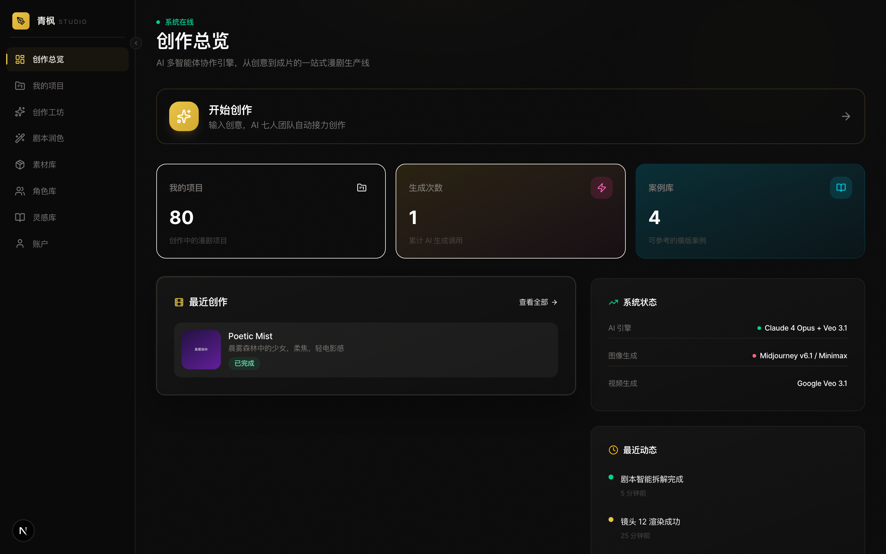
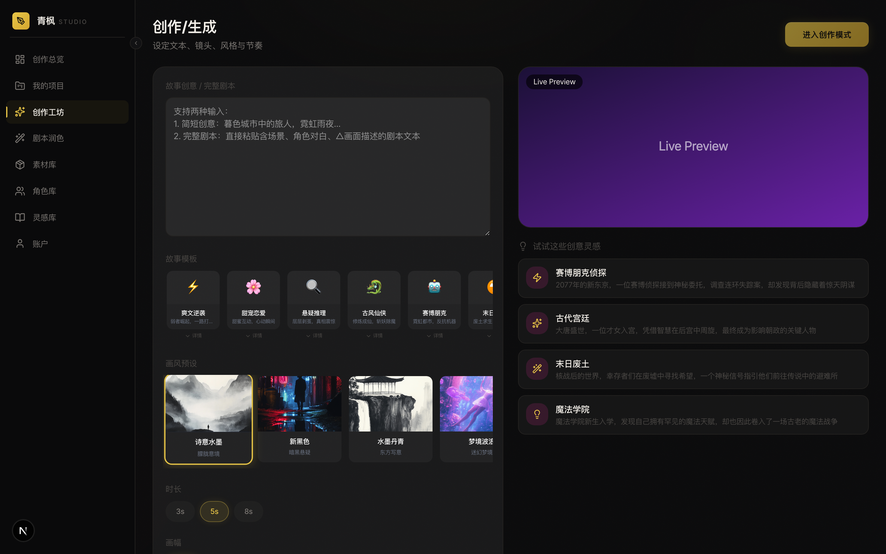
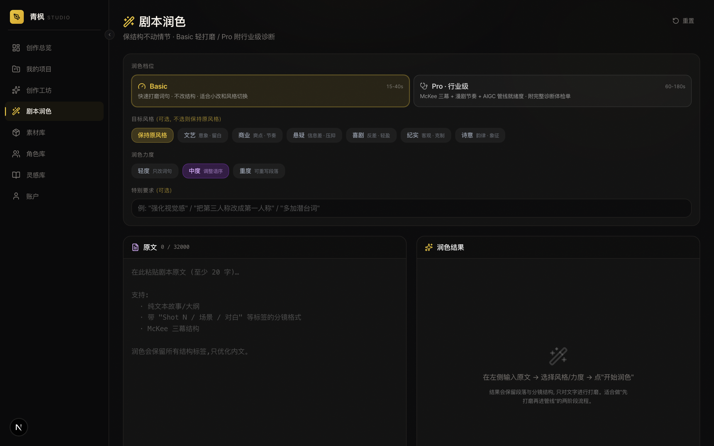
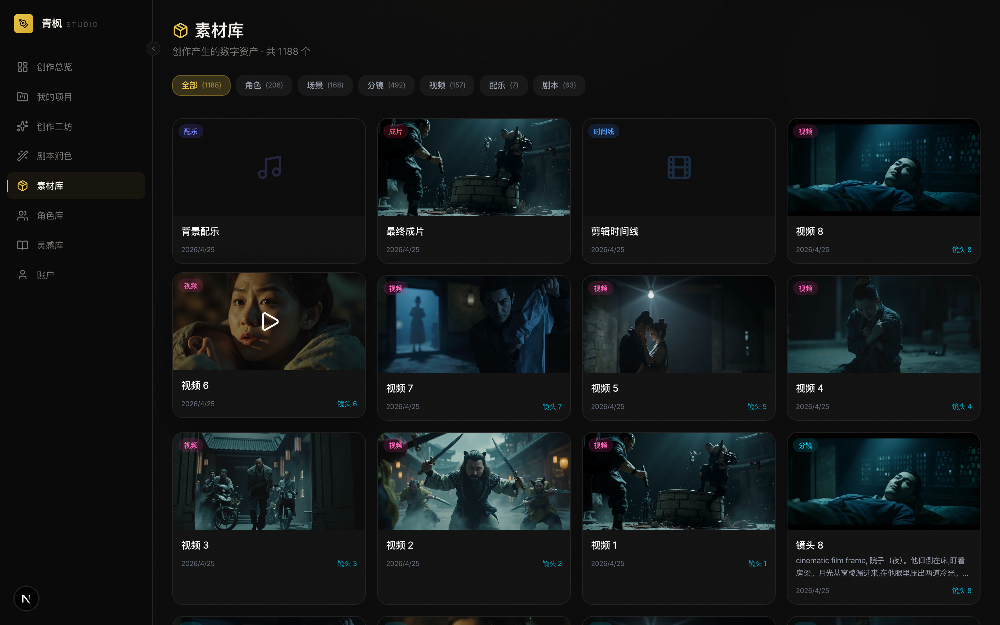
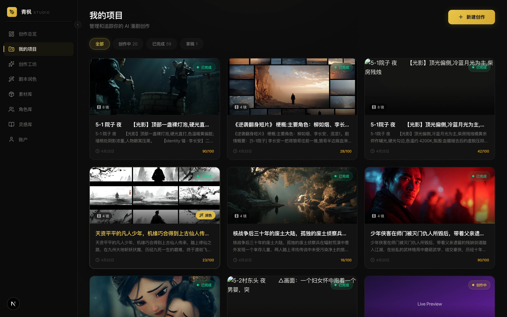

<p align="center">
  
</p>

<h1 align="center">Wind Comic 🌬️</h1>

<p align="center">
  <b>One line of text → one finished short-form drama.</b><br/>
  Multi-agent AI pipeline · cinematic storyboards · video output · character consistency by default.
</p>

<p align="center">
  <a href="https://github.com/ChrisChen667788/wind-comic/blob/main/LICENSE"></a>
  <a href="https://github.com/ChrisChen667788/wind-comic/actions/workflows/ci.yml"></a>
  <a href="https://github.com/ChrisChen667788/wind-comic/stargazers"></a>
  <a href="https://github.com/ChrisChen667788/wind-comic/releases"></a>
  
  
</p>

<p align="center">
  <b>English</b> · <a href="README.zh-CN.md">简体中文</a>
</p>

---

## ✨ Why Wind Comic?

Most "AI video" tools give you a 5-second clip from a one-line prompt. Wind Comic gives you a **finished short-form drama** — script, character bible, storyboards, voice-acted shots, BGM, and a final composition — from the same one line.

It works because it doesn't try to be one giant model. It's a **honest multi-agent pipeline**, where each role (Writer, Director, Producer, Designer, Editor) is a specialist that hands off to the next, with strict consistency contracts in between.

```
   "A noir detective walks into a rainy Hong Kong alley and recognizes his old partner."
                                       │
                                       ▼
   ┌────────────┐   ┌────────────┐   ┌────────────┐   ┌────────────┐   ┌────────────┐
   │  Writer    │──▶│  Director  │──▶│  Cameo     │──▶│  Storyboard│──▶│   Editor   │
   │  (McKee)   │   │ (cinema)   │   │ (faces)    │   │  (MJ/flux) │   │ (j/l-cut)  │
   └────────────┘   └────────────┘   └────────────┘   └────────────┘   └────────────┘
       │                  │                │                │                │
       │                  │                ▼                ▼                ▼
       │                  │          Auto-retry if    Per-shot ref       BGM beat
       │                  │          score < 75       --cref / --sref    aligned
       └──── all backed by Polish Studio Pro · 343 tests · 0 tsc errors ────┘
```

---

## 🎬 Screenshots

A real walk-through of the v2.12.0 build — every panel below is the actual app, not a mockup.

### Workspace overview

The 创作总览 dashboard: project counter, system-status panel (live LLM / image / video providers in use), recent activity feed.

<p align="center">
  
</p>

### Creation pipeline

The 创作工坊 page — paste a one-line idea, pick a style template + duration, hit a single button, and the multi-agent pipeline takes over. Live preview on the right shows what's being assembled in real time.

<p align="center">
  
</p>

### Polish Studio Pro

剧本润色 — Basic vs Pro tier, McKee + Field + Seger framework, multi-dimensional industry audit (打钩 = passed; 数字 = score), before/after diff panel.

<p align="center">
  
</p>

### Asset library (素材库)

Every character / scene / shot / video / music asset auto-deposits here. Filterable by type, searchable, reusable across projects.

<p align="center">
  
</p>

### Project library

我的项目 — every short film you've created, with auto-generated cinematic covers and AIGC-ready badges.

<p align="center">
  
</p>

### Per-project storyboard view

The heart of the pipeline — every shot's script, character lock state, scene anchor, and Cameo retry status all visible in a single timeline.

<p align="center">
  
</p>

---

## 🚀 What's in the box

| | What it does | Where it lives |
|---|---|---|
| **🖋 Polish Studio Pro** | McKee / Field / Seger framework, dual-tier polish, industry audit card, 10-version history, Word/Markdown export | `lib/polish-prompts.ts`, `components/polish/` |
| **🎭 Cameo Vision Auto-Retry** | Vision-LLM scores each shot against the character ref; below 75 → auto-regen with progressive ref boost | `services/cameo-retry.ts`, `lib/cameo-vision.ts` |
| **🧬 6-D Character Bible** | Gender / age / skin / build / wardrobe / personality auto-extracted from face uploads, persisted across projects | `lib/character-traits.ts` |
| **🎯 Scene Anchoring + 3-Tier `cw`** | Locked-face (cw 125) / lead (100) / supporting (80) — explicit consistency contract per shot | `lib/consistency-policy.ts` |
| **🎬 Cinematic Editor** | 14-vocabulary transition planner: match-cut · j-cut · l-cut · whip-pan · cross-fade — backed by real ffmpeg pipeline | `services/video-composer.ts` |
| **🔊 TTS / BGM Resilience** | Silent-mp3 fallback on TTS failure preserves time axis; per-shot audio warnings surface to UI | `lib/audio-silence.ts` |
| **🤖 Agent Chat Sidebar** | 7 SSE-streamed agents on every project page — talk to your Writer / Director / Critic in-app | `components/agent-chat-sidebar.tsx` |
| **🧪 Test discipline** | 343 vitest tests · TypeScript strict · single-fork SQLite isolation | `tests/`, `vitest.config.ts` |

---

## 🏃 Quick start

```bash
git clone https://github.com/ChrisChen667788/wind-comic.git
cd wind-comic

npm install
cp .env.example .env.local
# fill in at minimum: OPENAI_API_KEY + MINIMAX_API_KEY

npm run dev
# → http://localhost:3000
```

That's it. The first run will create a local SQLite DB at `data/qfmj.db` and seed a demo account.

### Cheapest viable config

You only need **two** keys to get a working pipeline:

- `OPENAI_API_KEY` — any OpenAI-compatible (OpenAI, Anthropic Claude, [vectorengine.ai](https://vectorengine.ai), [openrouter](https://openrouter.ai))
- `MINIMAX_API_KEY` — image + video + TTS in one provider, ~¥0.15/sec

### Cinematic config (recommended)

Add these for noticeably better output quality:

- `MJ_API_KEY` (via aggregator) — Midjourney for storyboards · best character/scene refs
- `QINGYUNTOP_API_KEY` — Sora-2 / Veo-3.1 fallback for the final cinematic shots
- `FAL_KEY` — FLUX Kontext for state-of-the-art reference-image consistency

See [.env.example](.env.example) for the full list with inline docs.

---

## 🧠 How it actually works

Wind Comic is built on a few ideas that — separately — are obvious, and together — surprisingly few projects do well.

### 1. Each agent has one job and a strict output contract

The Writer doesn't generate images. The Designer doesn't write dialogue. The Editor doesn't think about character consistency. Every handoff is a typed JSON contract you can inspect in `types/` and the orchestrator (`services/hybrid-orchestrator.ts`) is essentially a well-typed router between them.

### 2. Consistency is enforced by *measurement*, not by *prompting harder*

Most pipelines tell the model "draw the same character" and hope. Wind Comic's `Cameo Vision Auto-Retry` actually scores each generated shot against the canonical reference using GPT-4o Vision. If the score is below 75, the orchestrator regenerates with a `cw` boost (`100 → 125`) and an extra `--cref`. If the second attempt is *worse* than the first, it rolls back. There's a real feedback loop, with telemetry.

### 3. Provider abstraction is real, not aspirational

Every model is behind a service module (`services/openai.service.ts`, `services/minimax.service.ts`, `services/midjourney.service.ts`, `services/veo.service.ts`, ...) with a normalized signature. Want to swap MiniMax for Vidu? Edit the router. Want to plug in your local ComfyUI? Set `COMFYUI_ENABLED=true`. Want to use the open-source [XVERSE-Ent](https://github.com/xverse-ai/XVERSE-Ent) MoE screenwriter instead of Claude? Set `XVERSE_ENABLED=true`. Done.

### 4. Polish Studio Pro is its own application

Most "AI video" tools treat the script as a prompt. Wind Comic treats it as a first-class artifact: it has its own `Polish Studio` page (`/dashboard/polish`) with a Robert McKee–framed audit card, 10-version history, LCS-diff panel, and one-click Word export. Use it standalone if you don't care about video.

---

## 🛠 Tech stack

| Layer | Tech |
|---|---|
| Framework | Next.js 16 (App Router, Turbopack) |
| UI | React 19 · Tailwind v4 · Zustand · Radix · Framer Motion |
| LLM | Any OpenAI-compatible — defaults to `claude-sonnet-4` for creative, `gpt-4o-mini` for routine |
| Image | Midjourney → Minimax `image-01` → flux.1-kontext-pro → fal/ComfyUI (cascading) |
| Video | Minimax `Hailuo-2.3` (T2V) / `I2V-01` (I2V) → Veo `veo3.1-fast` → Kling fallback |
| TTS | Minimax `speech-2.8-hd` |
| Music | Minimax `music-2.6` |
| Composition | ffmpeg via `fluent-ffmpeg` + `ffmpeg-static` |
| Storage | SQLite (better-sqlite3) + Drizzle — Postgres migration tracked for v3.x |
| Auth | JWT + bcrypt + invite codes |
| Test | Vitest 4 · @testing-library/react · single-fork pool for SQLite |
| Telemetry | Sentry (lazy-loaded, opt-in) |

---

## 📦 Configuration

All configuration is via environment variables — no config file dance, no UI-driven secrets.

The full annotated list is in [.env.example](.env.example). Three quick highlights:

- **Provider URLs are user-overridable.** Default `OPENAI_BASE_URL` is `https://api.openai.com/v1`, but every aggregator that speaks the OpenAI protocol works (vectorengine.ai, openrouter, your own deployment). Same pattern for `MJ_BASE_URL`, `MINIMAX_BASE_URL`, `VEO_BASE_URL`.
- **You can self-host the writer.** Set `XVERSE_ENABLED=true` and point `XVERSE_BASE_URL` at your vLLM/sglang server running [XVERSE-Ent](https://github.com/xverse-ai/XVERSE-Ent). Wind Comic will use it for the Writer agent and fall back to Claude/GPT only when XVERSE errors out.
- **You can run without GPU spend.** Stand up a local ComfyUI, set `COMFYUI_ENABLED=true`, and the image router will prefer it over paid providers.

---

## 🗺 Roadmap

The full plan is in [ROADMAP.md](ROADMAP.md). Highlights of what's next:

| Sprint | Theme | Target |
|---|---|---|
| **A** _(in progress)_ | Consistency Deepening — Cameo Bible · 6-D face extraction · scoring dashboard | v2.13 |
| **B** | Editing Realism — j-cut/l-cut audio offset · subtitle animation · beat-driven cuts | v2.14 |
| **C** | Platform — Stripe 4-tier billing · GitHub Actions CI/CD · U2V reference-driven | v3.0 |
| **D+** | Cross-project Cameo IP economy · LLM Vision Audit · LangGraph IDE · multiplayer | v4.x |

---

## 🤝 Contributing

PRs welcome. See [CONTRIBUTING.md](CONTRIBUTING.md) for setup, project structure, and the PR checklist. Issues tagged `good first issue` are scoped to ~half a day for a developer new to the codebase.

If you want to add a new AI provider, follow the pattern in `services/` — each provider is one file, ~150 lines, with a normalized async signature.

---

## 🛡 Security

Found a vulnerability? Please **don't open a public issue** — email <chenhaorui667788@gmail.com> directly. See [SECURITY.md](SECURITY.md) for the full disclosure policy and the self-hoster hardening checklist.

---

## 📜 License

[MIT](LICENSE) © 2026 [ChrisChen667788](https://github.com/ChrisChen667788)

You are free to use, fork, and commercialize Wind Comic. If it ends up powering your studio, a star is the only thanks I need. If it ends up making you money, [@ me on Twitter](https://github.com/ChrisChen667788) — I want to see what you built.

---

<p align="center">
  Built with ❤️ + Claude · <a href="https://github.com/ChrisChen667788/wind-comic">github.com/ChrisChen667788/wind-comic</a>
</p>
