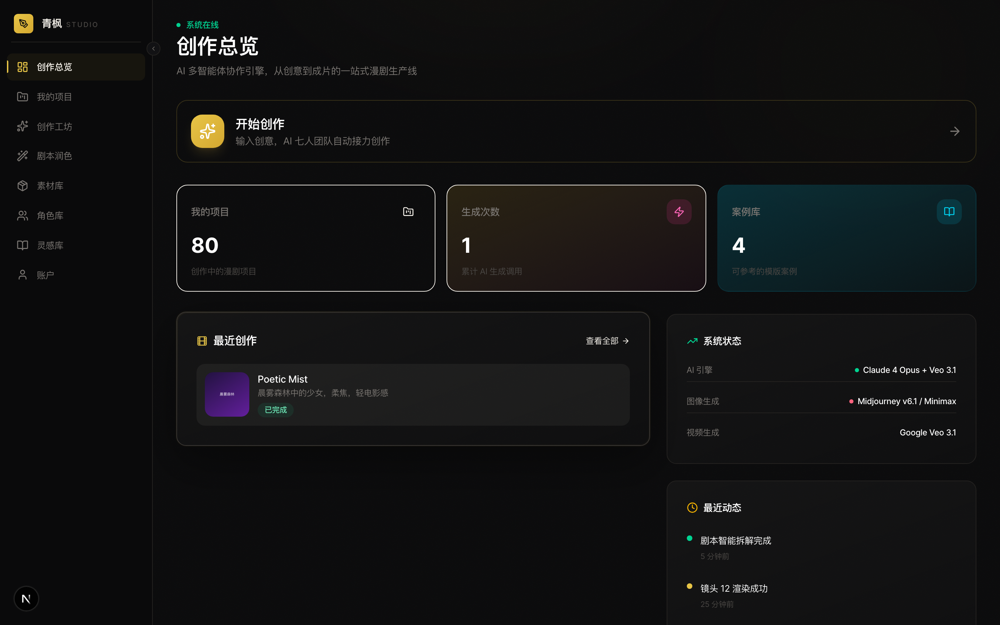
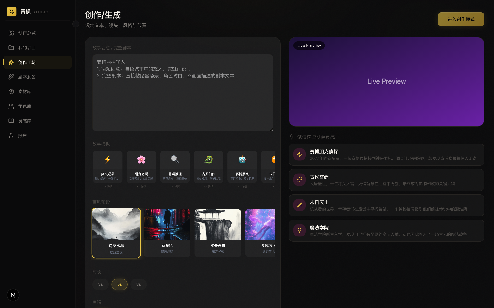
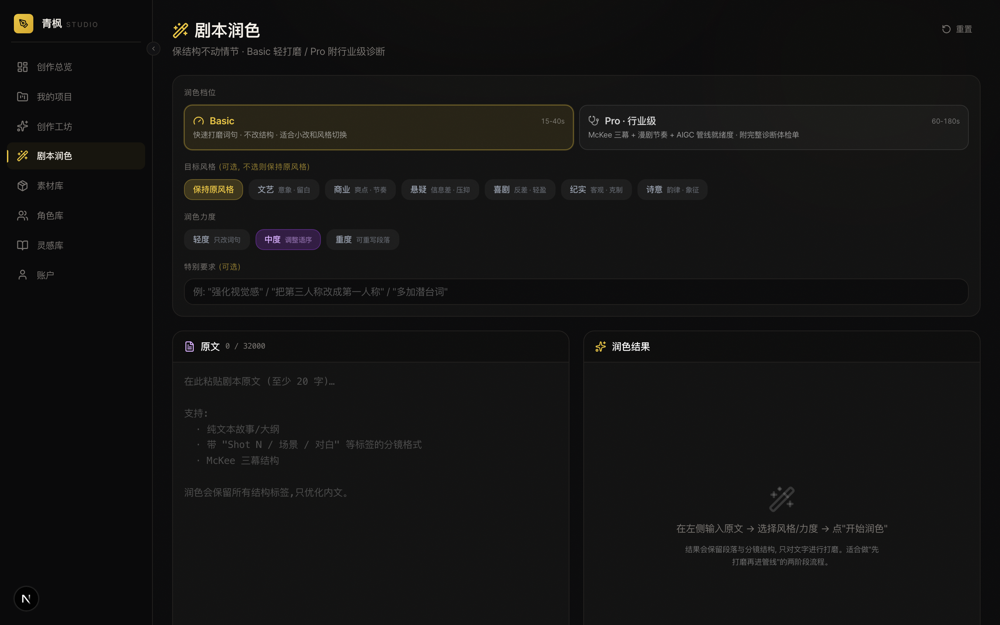
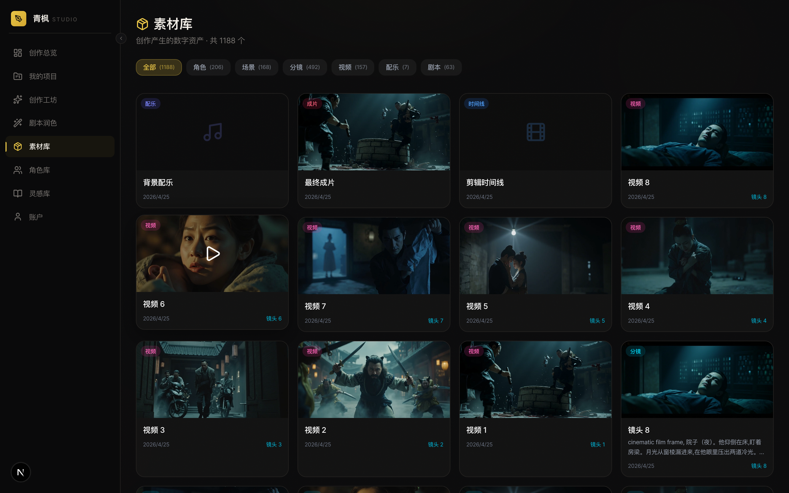
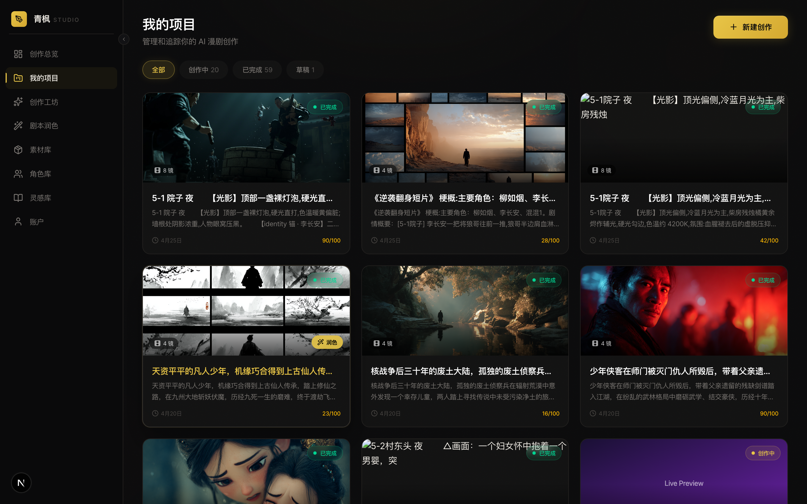
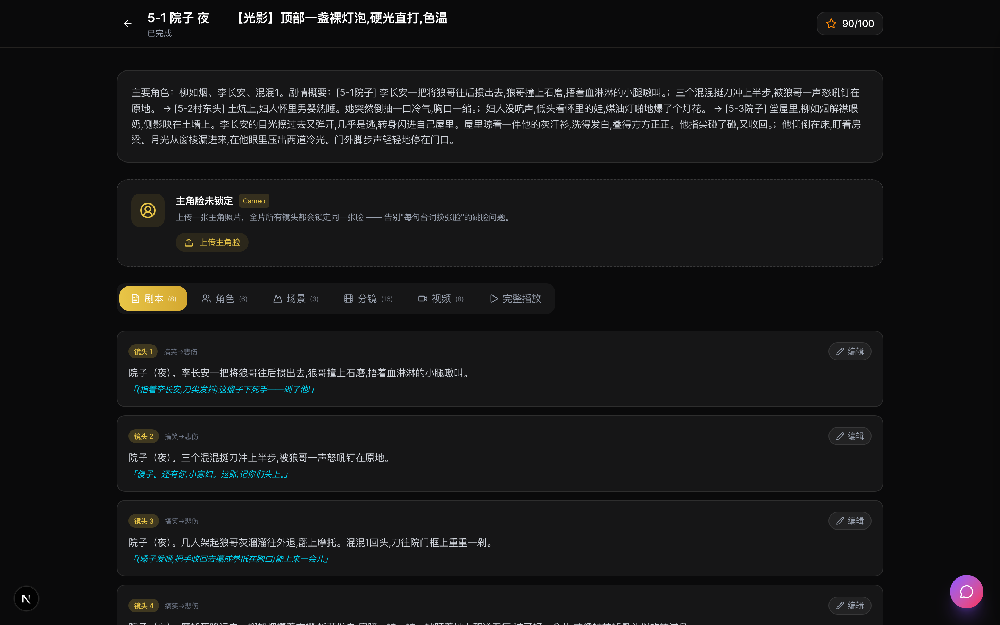

<p align="center">
  
</p>

<h1 align="center">🌬️ Wind Comic 风之漫剧 <sub><sup>v3.1.3</sup></sub></h1>

<p align="center">
  <b>一句话进, 整片短剧出.</b><br/>
  多 Agent AI 流水线 · 电影级分镜 · 视频成片 · 实时多人协作 · 自带 LLM API.
</p>

<p align="center">
  <a href="README.md">English</a> · <b>简体中文</b> · <a href="docs/MARKETING-zh.md">🔥 营销文案</a> · <a href="docs/llm-providers.md">🔌 接你自己的 LLM</a>
</p>

---

## ✨ 为什么选 Wind Comic?

大多数 "AI 视频" 工具给你 5 秒短片. **Wind Comic 给你一整部短剧** — 剧本 + 角色 + 多镜分镜 + 配音 + BGM + 嘴型对齐的口播 + 最终 mp4 — 全部从同一句创意开始.

它不试图做"一个超大模型把全干了". 它是一条**诚实的多 Agent 流水线**: 每个角色 (编剧 / 导演 / 角色师 / 分镜师 / 锁脸 / 嘴型 / 剪辑) 都是专家, 用严格的一致性契约逐步交付. 再叠一层**实时多人时间线**, 像 Figma 一样多人改片.

```
   "重生归来的霸总当街拆穿前未婚妻的婚礼骗局"
                       │
                       ▼
   编剧 ▶ 导演 ▶ Style Bible ▶ 角色设计 ▶ 场景设计 ▶
   ▶ 分镜 (vision 审计) ▶ 视频 (多引擎 race) ▶
   ▶ TTS (按角色配音) ▶ 嘴型对齐 (Kling/Sync.so/Hailuo) ▶
   ▶ 剪辑 (j-cut/l-cut + 按幕 BGM + 中文字幕烧入) ▶ final.mp4

   + 实时协作时间线 (Yjs CRDT)
   + 接你自己的 LLM (3 行 .env, 0 改代码)
   + 图像/视频 provider 可换 (内置 12+ 可选)
```

---

## 🎯 谁该用 Wind Comic?

| 你是... | Wind Comic 能给你什么 |
|---|---|
| **竖屏短剧创作者** (霸总 / 重生 / 战神 / 古装) | trope 感知的编剧, 第 1 镜钩子起手, 反转密度审计, cliffhanger 检测, 默认 9:16 |
| **内容营销团队** | 1 句 idea → 30 秒精修广告片, 角色跨镜一致, 中文字幕真烧入, 品牌安全负向 prompt |
| **独立电影人 / 视频创作** | Style Bible 锁全片画风, McKee 三幕结构, Logic Pro 风格多轨道时间线, 真 BGM 波形可编辑 |
| **漫画 / 漫剧工作室** | 剧本 → 你选画风的分镜, cref+sref+DNA 三重锁脸, 拖拽重排镜头, 单镜重生 |
| **教育 / 解说作者** | 节奏审计提醒"哪里太平", 每镜冲突分数, 钩子改进建议 |
| **开源开发者** | 3 行环境变量就能换 LLM (OpenAI / Claude / DeepSeek / 通义 / Kimi / OpenRouter / 本地 Ollama 全可用) |

---

## 🚀 亮点功能 · 同类竞品不具备的能力

### 1. **多 Agent 流水线, 不是黑盒大模型**
导演规划故事 → 编剧按 McKee 写对白 → Style Bible 帧锁住整片视觉 → 角色师抽 8 维 **DNA 签名** → 分镜师渲染同时跑 Vision 审计 (<70 分自动重生) → 视频制片多引擎竞速 (Minimax / Veo / Kling) → 剪辑师按情绪节奏 j/l-cut + 烧入中文字幕.

### 2. **视觉一致性的秘密武器 — Style Bible Frame** (v2.20)
我们从 Director 的 plan 渲染**一张 canonical "key art" 帧**, 然后作为后续所有分镜的首个 `--sref` 注入. 效果: 6 镜画风像同一部剧, 不是 6 次 Midjourney 抽卡. (大多数竞品只有 2 帧滚动链, 第 6 镜根本不知道第 1 镜长啥样.)

### 3. **9:16 默认 + 12 个短剧 trope 模板** (v2.20 P0.2)
Writer prompt 检测短剧 / 漫剧类型 → 切竖屏画布 + 注入经典钩子 (重生回到 N 年前 · 当街掌掴 + 秘密身份 · 系统提示音突响 等). McKee 三幕仍打底; trope 是表层.

### 4. **真正能用的中文字幕** (v2.22)
彻底解决 "AI 视频里的中文字幕变鬼画符" 问题: **从视频 prompt 里剥掉对白文字** (让模型不要尝试画字) + 加狠的负向 prompt (`--no text --no chinese --no captions`) + 后期用 ffmpeg `subtitles` filter 烧真字幕, 字体自动找系统 CJK (PingFang / Noto Sans CJK).

### 5. **锁脸三件套 = cref + sref + 8 维 DNA + Cameo Vision Retry** (v2.21 P1.2)
不止参考图 hack: 每个角色的三视图过一次 Vision LLM 抽结构化特征 (眼型 / 下颌 / 发型 / 标志服饰 等), 作为自然语言锚点注入每个出场镜头 prompt. 加上 cameo-vision-retry: 某镜角色匹配度 <75 自动重生, cw 拉高重画.

### 6. **Logic Pro 风格多轨道时间线 + 实时协作** (v3.1.1–v3.1.3)
- 3 轨道: 分镜 / BGM / 字幕
- **真 BGM 波形**用 Web Audio API decode (不是程序生成的假波形)
- **拖拽改时间 + 双边沿拉伸**改时长
- **自动吸附邻居** (0.4s 阈值) + 硬碰撞防重叠
- **实时多人协作**: Yjs awareness 画出对方光标, 头像下方显示对方在哪个 tab, Y.Map 锁防止两人编辑同段
- **项目邀请**支持只读 / 可评论 / 可编辑 三档权限

### 7. **真正能用的 Lipsync**
Kling lip-sync API 做口播口型, 自动 fallback 到 Sync.so / Hailuo. 流水线从 prompt 里剥掉对白让模型只画唇形 *运动*, 然后后期把唇形对齐到 TTS 音频.

### 8. **节奏 / 反转 / Cliffhanger 审计** (v2.21 P1.1)
编剧完成后, 每镜按中文冲突词字典打分 0-10 + 检测情绪极性反转 + 检测 cliffhanger 关键词. 竖屏短剧 <2 次反转或第 1 镜冲突 <5 → 节奏 tab 弹警告 + 给改进建议.

### 9. **接你自己的 LLM** (v3.1.3)
所有文本 LLM 调用 (导演 / 编剧 / vision / 审计) 走一个 OpenAI 兼容 `chat/completions` 端点. 想换 DeepSeek-r1 / GPT-4o / Claude (via OpenRouter) / 通义 Max / 本地 Ollama? **改 3 行 `.env` 完事, 0 改代码**. 完整矩阵见 [`docs/llm-providers.md`](docs/llm-providers.md).

### 10. **1150 个单测全过, TypeScript 严格模式, 没有"敬请期待"**
上面列的每个功能都已经在 `main` 分支, 类型检查零错误, 单测覆盖, 你 `npm install && npm run dev` 就能在 `/projects/[id]` 看到.

---

## 🥊 跟竞品比

| 能力 | Sora 2 | Kling 2.0 | Vidu Q3 | Runway Gen-4 | Higgsfield | **Wind Comic** |
|---|---|---|---|---|---|---|
| 一句 prompt 多镜叙事 | ⚠️ (一段连续) | ❌ | ❌ | ⚠️ | ⚠️ | ✅ 多 Agent |
| 跨镜角色一致性 | ✅ | cref/sref | subject-ref | scene 记忆 | ✅ | **✅ cref+sref+8 维 DNA+vision 重生** |
| 全片画风锁定 | ⚠️ | ❌ | ⚠️ | ✅ | ✅ | **✅ Style Bible 帧** |
| 中文字幕真渲染 | ❌ | ⚠️ | ⚠️ | ❌ | ❌ | **✅ libass + PingFang 烧入** |
| 竖屏短剧 trope | ❌ | ❌ | ❌ | ❌ | ❌ | **✅ 12 模板 + 9:16 默认** |
| 实时协作时间线 | ❌ | ❌ | ❌ | ❌ | ⚠️ (闭源) | **✅ Yjs CRDT + Y.Map 锁 + 光标** |
| 可自部署 | ❌ | ❌ | ❌ | ❌ | ❌ | **✅ Next.js + SQLite + Web Audio** |
| 接你自己 LLM | ❌ | ❌ | ❌ | ❌ | ❌ | **✅ 12+ provider 走 .env** |
| 开源 | ❌ | ❌ | ❌ | ❌ | ❌ | **✅ MIT** |
| 单镜改 prompt 重生 | ⚠️ | ⚠️ | ⚠️ | ✅ | ✅ | **✅ + 用户上传参考图** |
| 节奏 / 冲突审计 | ❌ | ❌ | ❌ | ❌ | ❌ | **✅ 每镜评分 + 反转检测** |

> ⚠️ 表示该 provider 有这能力但形态受限 (例如"只能在付费 Pro 档通过 UI 面板用").

---

## 🎬 实机截图

完整 v3.1.3 实拍 — 下面每张图都是真应用, 不是 mockup. 完整截图清单见 [`docs/SCREENSHOTS.md`](docs/SCREENSHOTS.md).

### 创作总览
顶部 API 配额告警 banner (v2.17) + 通知 bell (v3.0 P0.1).
<p align="center"></p>

### 创作工坊
粘贴 idea, 选故事模板 (内置 18 个: 霸总 / 重生 / 赛博 / 古装 / 儿童 / 纪实 / 科幻 / 恐怖 等), 一键开机. 模板自动填时长 / 画幅 / 镜头语言默认值.
<p align="center"></p>

### Polish Studio Pro
McKee + Field + Seger 三家框架结合, 多维行业审核 (打钩 = 过; 数字 = 分), 前后对比 diff.
<p align="center"></p>

### 素材库
角色 / 场景 / 分镜 / 视频 / 音乐 / 模板 — 跨项目复用.
<p align="center"></p>

### 我的项目
所有短片 + 自动生成的电影感封面 + ScoreDonut 质量徽章.
<p align="center"></p>

### 分镜详情
每镜 Cameo retry 分数 + Style Audit 4 维 + 单镜重生按钮.
<p align="center"></p>

### 🆕 Cinema 时间线 (v3.1.x — 多轨道 + 协作)
3 轨布局 (分镜 / BGM / 字幕), 拖拽改时间, 双击字幕改文字, 拖边沿改时长, 真 BGM 波形, 实时其他用户光标 + 名字标, 段锁标识.
<p align="center"><em>📸 待重拍 — 见 <code>docs/SCREENSHOTS.md</code> 新清单.</em></p>

### 🆕 节奏分析 (v2.21 P1.4)
每镜冲突分柱状图, 反转箭头, 警告 + 建议.
<p align="center"><em>📸 待重拍.</em></p>

### 🆕 邀请协作者 (v3.x.1)
生成只读 / 可评论 / 可编辑 三档邀请链接 + 过期时间, 管理当前协作者.
<p align="center"><em>📸 待重拍.</em></p>

### 🆕 评论 + @ 提及 (v3.0 P0.1)
项目级 + 每镜独立的嵌套评论, @ 自动补全, 通知 bell.
<p align="center"><em>📸 待重拍.</em></p>

---

## 🏁 快速开始

```bash
# 1. 拉代码 + 装依赖
git clone https://github.com/ChrisChen667788/wind-comic.git
cd wind-comic
npm install

# 2. 配置 (3 行必填, 换 LLM provider 看 docs/llm-providers.md)
cp .env.example .env.local
# 编辑 .env.local:
#   OPENAI_API_KEY=sk-...
#   OPENAI_BASE_URL=https://api.openai.com/v1     # 或任何 OpenAI 兼容 provider
#   OPENAI_MODEL=gpt-4o                            # 或 claude-opus-4 via OpenRouter 等

# 3. 启动
npm run dev                # Next.js on :3000
# (可选) 开第 2 个终端跑实时协作:
npm run dev:ws             # Yjs WebSocket server on :1234

# 4. 浏览器打开 http://localhost:3000 开始创作
```

**最低 LLM 要求**: 任何 ≥24B 参数 + 能稳定输出 JSON 的模型. 实测可用: gpt-4o, Claude Opus 4, DeepSeek-r1, 通义 Qwen-Max, MiniMax-M2, GLM-4.5, Kimi-K2.

**可选引擎** (没配也能跑, 自动 fallback):
- `MINIMAX_API_KEY` — image-01 / Hailuo-2.3 视频 / speech-2.8-hd TTS / music-2.6 BGM
- `KELING_API_KEY` — Kling Master 4K + 首尾帧融合 + 嘴型对齐
- `VIDU_API_KEY` — Vidu Q3 (16s 长片)
- `VEO_API_KEY` — Veo 3.1-fast 视频备选
- `SYNCSO_API_KEY` / `HAILUO_API_KEY` — 嘴型对齐备选 provider

---

## 🤝 贡献

欢迎 PR. 两条规则:
1. **不要破坏多 Agent 契约.** 每个 agent 输入输出 shape 在 `types/agents.ts`.
2. **测试是底线.** Vitest 1150/1150 必须保持绿. 新加 lib/service 必须配测试.

详见 [`CLAUDE.md`](CLAUDE.md) — 仓库的"代码风格"和 agent 设计笔记.

---

## 📚 文档

- [`docs/llm-providers.md`](docs/llm-providers.md) — 3 行 env 换 LLM provider
- [`docs/SCREENSHOTS.md`](docs/SCREENSHOTS.md) — 模块截图清单
- [`docs/MARKETING-zh.md`](docs/MARKETING-zh.md) · [`docs/MARKETING-en.md`](docs/MARKETING-en.md) — 营销文案
- [`ROADMAP.md`](ROADMAP.md) — 完整 sprint changelog (v2.10 → v3.1.3)
- [`docs/COMPETITIVE-GAP-2026-05.md`](docs/COMPETITIVE-GAP-2026-05.md) — vs Sora/Kling/Vidu/Higgsfield 诚实分析

---

## 📄 License

MIT. 用它 / fork 它 / 拿它创业. 唯一请求: 你做了酷功能就提 PR 回来.

---

<p align="center">
  Built with ❤️ — 我们相信 AI 生成的剧应该像剧, 不是科技 demo.<br/>
  <a href="https://github.com/ChrisChen667788/wind-comic/stargazers">⭐ Star 一下</a> 如果 Wind Comic 给你省了一周.
</p>
