# 青枫漫剧 · v12.425 资产真机截图图廊

> 回到 [README](../README.md)。
>
> 这一页单独成文,是为了**不让首页替访客扛下载量**:README 引用的媒体有 12MB 总预算门禁
> (`npm run preflight` 会卡),18 张详图放进去必然撑爆。首页只留四张代表图,
> 想看全套的点进来 —— 下载成本由真正想看的人自己决定,而不是每个访客都默认付。

> 全部由 `node scripts/capture-v12-425.mjs` 对着**本机真实数据**跑出来(1600×1500 @2x,降到 1600px 宽)。
> 脚本带空壳检测与近重复检测:页面没渲染出来、或者「点了 tab 但视图没变」的,一律删掉并如实报告 ——
> **一张截图冒充两张,比少一张更糟。**
>
> ⚠️ 更正一条旧结论:v12.416 那轮在这里记过「点项目页 tab 和滚 body 都不会改变视图」。**那条是错的。**
> 真因是标签栏在折叠线以下,坐标点击打空;先 `scrollIntoView` 再 `el.click()` 就能切。本轮 12 张靠它拍成。

#### 一、资产类型 · 素材库逐类真机图

素材库是全流水线的沉淀层:一次创作跑完,剧本 / 角色 / 场景 / 分镜 / 视频 / 配乐六类产物**自动落库并跨项目复用**。
下面每类各一张,数字是本机真实存量(共 1052 个资产)。

| 全部 1052 · 六类混排 | 角色 61 · 立绘与转身图 |
|---|---|
| 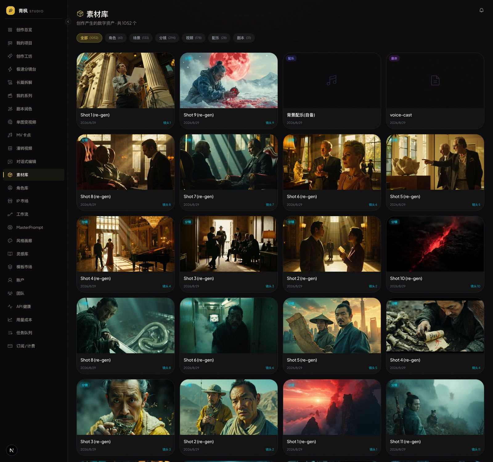 |  |

**实现逻辑**:每个 agent 节点产出后走同一条 `project_assets` 落库路径(`type` + `mediaUrls` + `data`),
素材库只是这张表的跨项目视图 —— 不是另建一套存储,所以「项目里看到的」和「素材库里看到的」永远是同一份。
**工作流架构**:`Writer → Character/Scene Designer → Storyboard Artist → Video Producer → Editor`,
每个节点写库时打 `type` 标签,素材库按标签筛选;`global_assets.embedding` 提供跨项目相似检索(BYO 文本嵌入,无 key 时退到精确名 + 文本匹配)。

| 场景 133 · 概念图 | 分镜 294 · 逐镜画面 |
|---|---|
| 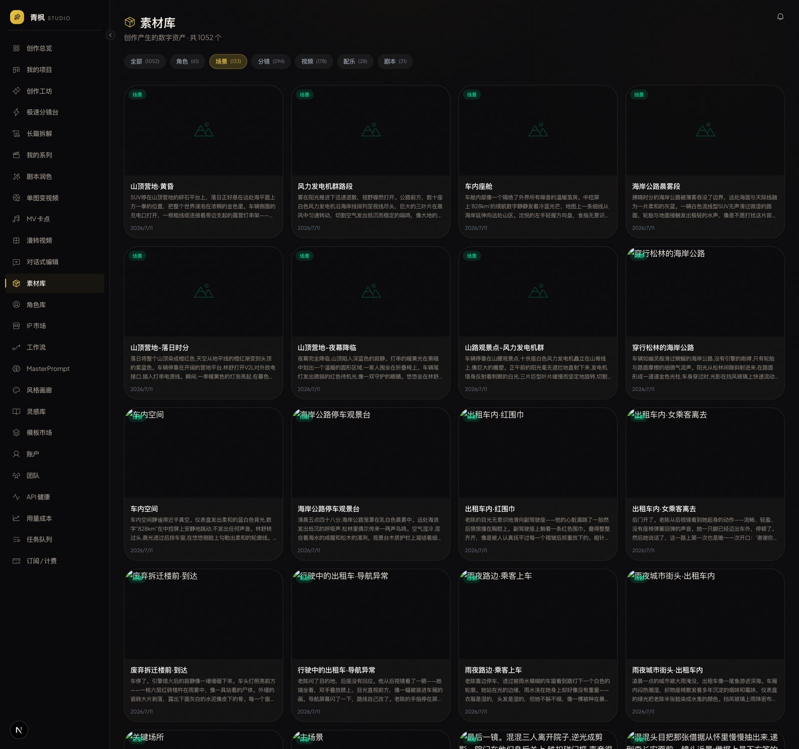 | 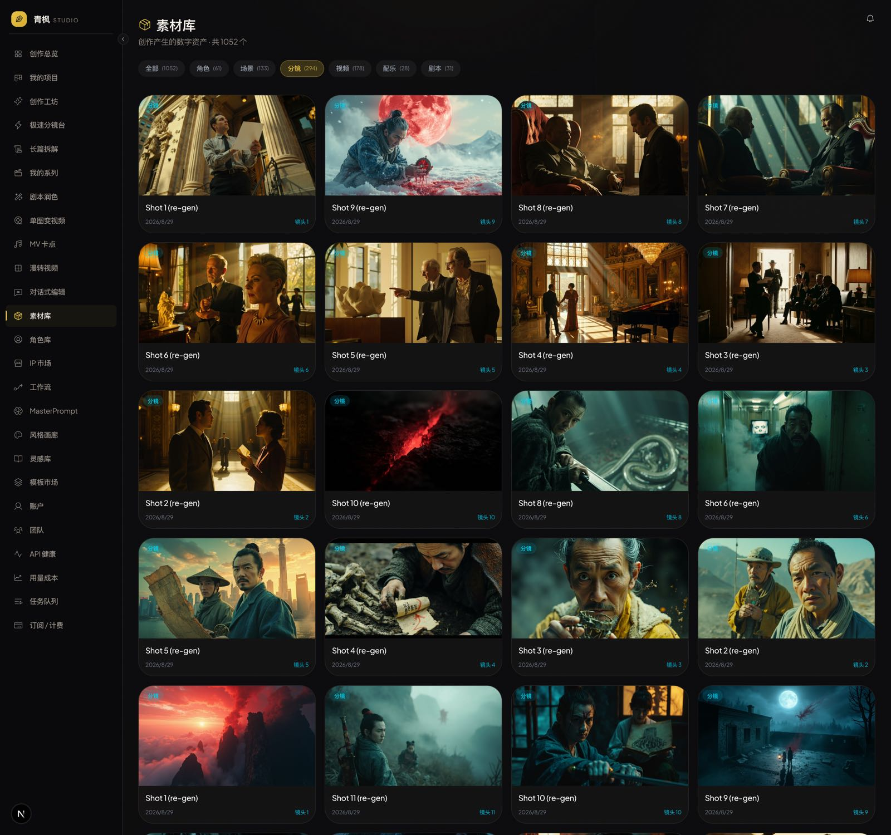 |

**实现逻辑**:场景与分镜共用一套图像 provider 抽象(`lib/image-providers/`),参考图走 `input_image` 通道
而不是塞进 prompt 文本(v12.424 修);分镜额外注入角色 DNA 与场景锚,保证跨镜一致。
**工作流架构**:分镜生成前先解析剧本分场 → 取该场景的 styleBible + 该镜出场角色的 DNA → 合成 prompt →
出图后跑 Cameo 一致性打分,低于阈值的镜进重生队列。

| 视频 178 · 镜头成片 | 配乐 28 · BGM 资产 |
|---|---|
| 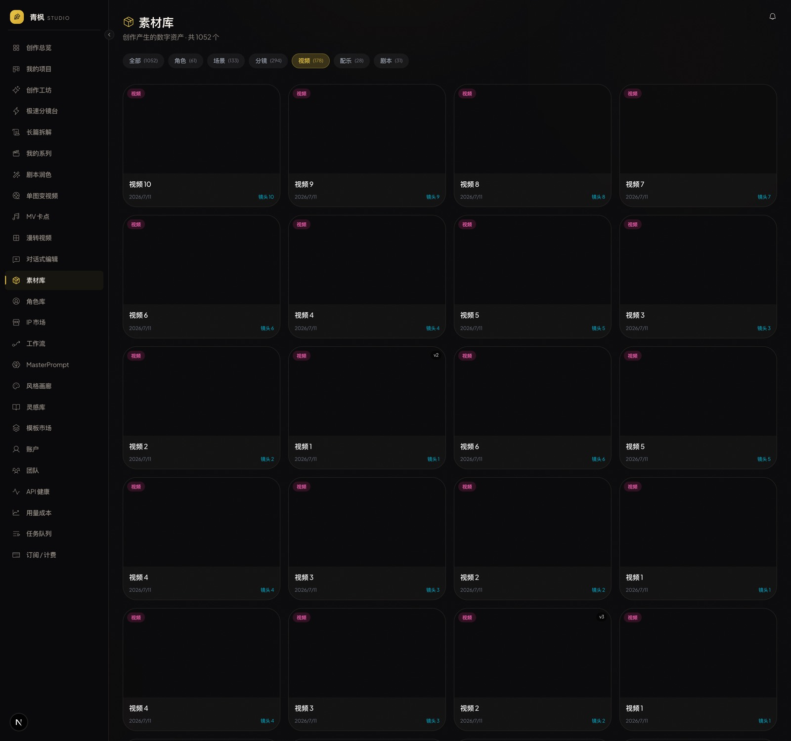 | 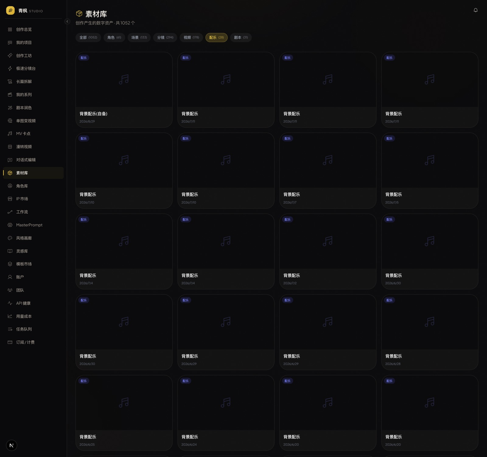 |

**实现逻辑**:视频侧是多引擎适配层(Kling / MiniMax / Veo / Vidu / Wan / 自托管),
每家的请求体、轮询路径、状态字面量差异收敛在各自 service 里,上层只看统一的 `{status, url}`;
配乐走 fallback 链(ElevenLabs → 自托管 → MiniMax),任一家挂了自动降级并如实告警。
**工作流架构**:`分镜图 → i2v 引擎 → 轮询 → 落库`;失败镜进「批量补渲」队列,
降级为 Ken Burns 占位片时会显式标记,不会伪装成成片被后续跳过。

| 剧本 31 · 分场与镜头表 | |
|---|---|
| 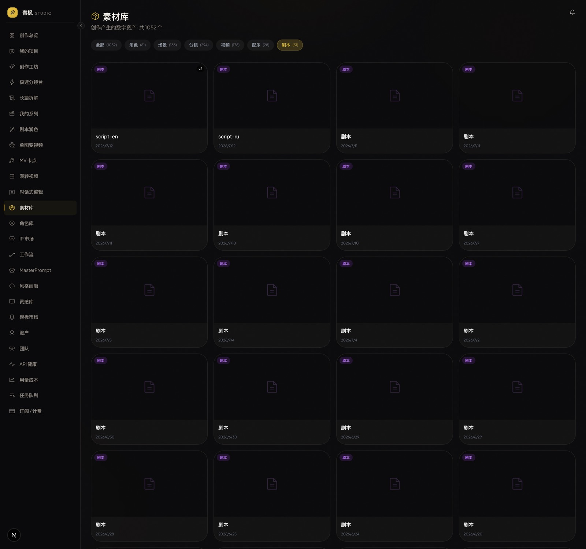 | 剧本是唯一的**结构化真值源**:分场、镜头、时长、情绪标签、beat 注记都挂在它上面,下游全部派生。 |

**实现逻辑**:剧本以 JSON 结构落库(`shots[]` 带 `duration` / `emotion` / `beat` / `dialogue`),
不是一坨自由文本 —— 所以时间线、拉片、节奏分析可以直接读同一份数据,不用二次解析。
**工作流架构**:一句创意 → LLM 出结构化剧本 → 人工可编辑 → 编辑结果回写同一份 JSON → 下游节点重跑时读到的就是新版本。

#### 二、角色资产 · 三个层次

| 项目内角色页 · 转身图完整呈现 |
|---|
| 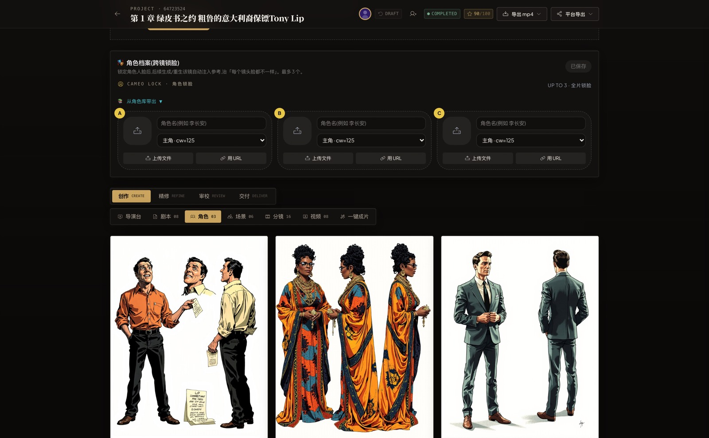 |

**实现逻辑**:角色立绘原生是 896×1152 的竖构图三视图(正面 / 四分之三 / 背面)。
**v12.425 修的就是这里** —— 修前它被塞进 355×200 的横框配 `object-cover`,**裁掉 56% 画面**,
用户必须点开全屏才看得到完整立绘。现在框比例跟素材走(`aspect-[7/9]`)、填充改 `object-contain`,
缩略图和全屏看到的是同一张完整画面。
**工作流架构**:角色设计师节点产出转身图 → 提取角色 DNA(五官 / 体型 / 服饰 / 气质结构化字段)→
写入 `character_library` 供跨项目复用 → 后续每镜生成时按名称匹配注入 DNA + 参考图,治「每个镜头脸都不一样」。

| 另一组角色 · 跨风格一致性 | 角色库 · 跨项目资产 |
|---|---|
| 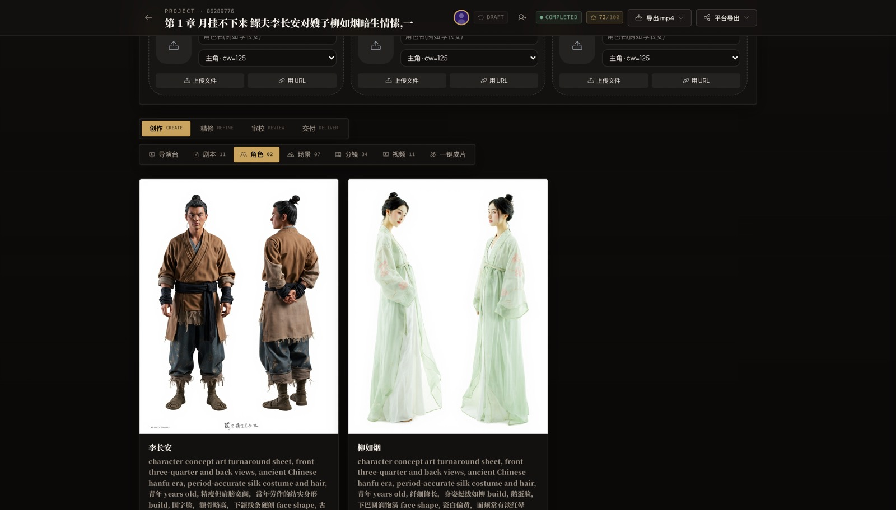 | 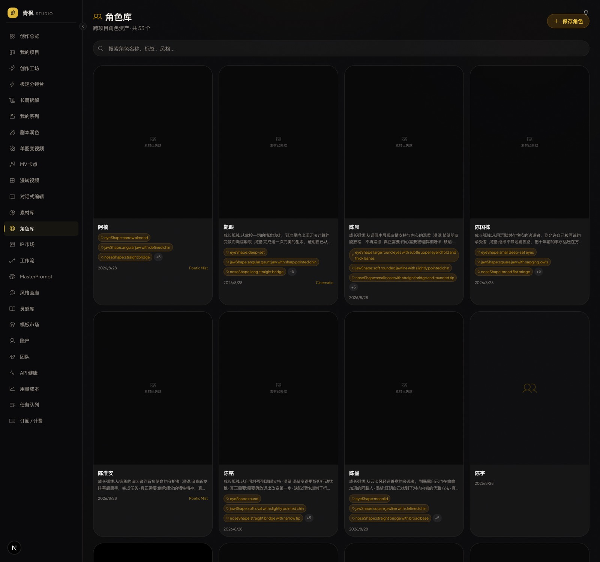 |

**实现逻辑**:角色库是跨项目的角色资产池,每条带结构化 DNA 标签(`eyeShape` / `jawShape` / `noseShape` …)
和使用次数;建新角色时会推荐「相似角色」一键复用,防重复建与跨集漂移。
**工作流架构**:`建角色 → DNA 提取 → 向量入库 → 相似检索 → 一键带出到新项目的锁脸槽位`。
截图中的「素材已失效」占位是 v12.425 另一处修复:本机那次定时清理删掉了底层文件,
修前 `onError` 直接 `display:none`,卡片变成一片空白,用户既不知道有过图也不知道为什么没了 —— 现在如实说明。

#### 三、导演台与创作过程

| 导演台 · 全链路控片 |
|---|
| 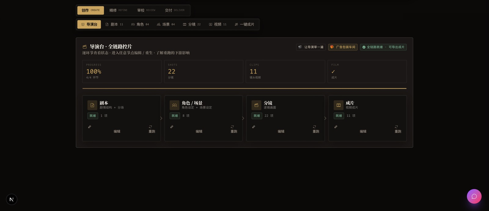 |

**实现逻辑**:导演台不是一个进度条,而是**四个环节的可寻址控制面**:剧本 / 角色·场景 / 分镜 / 成片,
每环各自有就绪态与产物计数,任一环都能单独「编辑」或「重跑」,并预告重跑的下游影响
(改剧本会脏化分镜与成片,改分镜只脏化成片)。
**工作流架构**:`pipeline_jobs` 表按环节切分,每个 job 记录输入指纹;
重跑时对比指纹决定下游哪些节点必须失效 —— 这是「改一处不用全片重来」的前提。

| 一键成片 · 端到端流水线 | 创作工坊 · 从一句创意开机 |
|---|---|
| 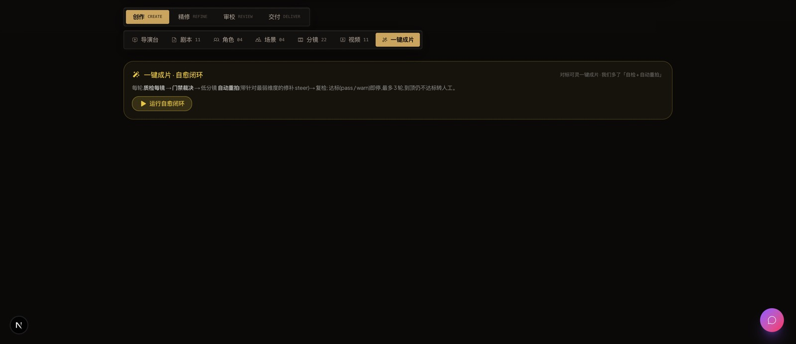 | 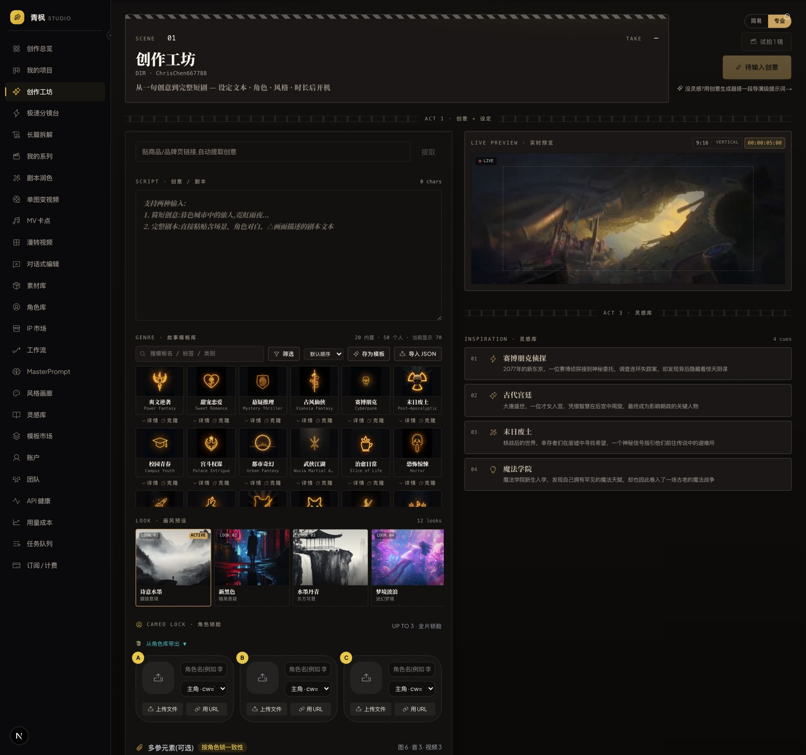 |

**实现逻辑**:一键成片把上面四环串成一条无人值守链路,中途失败按环节暂停而不是整条失败
(v12.413 的 pause-not-fail 预算);创作工坊则是入口层,支持「一句创意」或「直接粘贴完整剧本」两种输入,
右侧实时预览画幅与时长,下方是内置 + 个人模板库。
**工作流架构**:`创意/剧本 → 结构化剧本 → 角色·场景设定 → 分镜出图 → 逐镜 i2v → 剪辑合成 → 成片`,
每步的产物都落 `project_assets`,所以任一步都可以停下来人工介入再继续。

#### 四、专业能力 · 这条流水线到底交付什么

| 分镜规格 · 出厂参数 + 一致性仪表 |
|---|
| 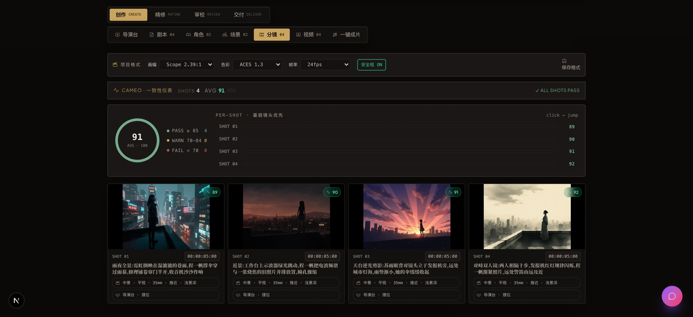 |

**实现逻辑**:项目级画幅 / 色彩 / 帧率 / 安全框是**工程参数不是滤镜**(Scope 2.39:1 · ACES 1.3 · 24fps),
它们会真实进入生成 prompt 与导出参数;右侧一致性仪表逐镜给 Cameo 分,低分镜可一键跳转重生。
**工作流架构**:`项目格式 → 注入每镜 prompt → 出图 → Vision 打分 → 低分回流重生`,形成闭环而不是一次性生成。

| 镜头视频 · 逐镜成片 | Cinema 时间线 · 多轨编排 |
|---|---|
| 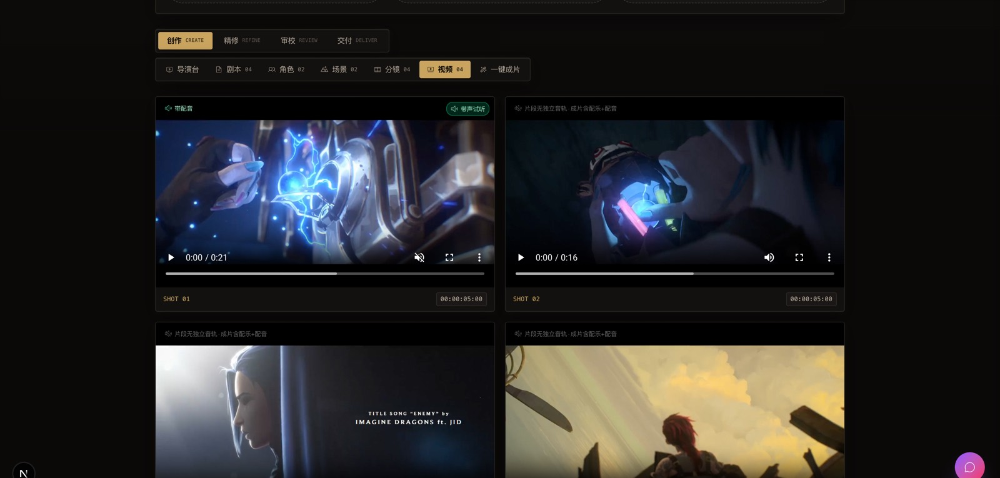 | 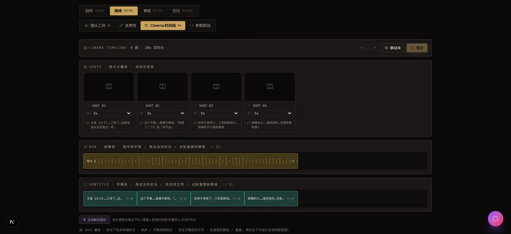 |

**实现逻辑**:时间线是三轨(SHOTS / BGM / SUBTITLE),支持拖拽重排、拖边改时长、双击改字幕,
BGM 轨是 Web Audio 真解码出来的波形而不是装饰图 —— 所以卡点剪辑能把切点吸附到真实拍点上。
**工作流架构**:`镜头视频 + BGM + 字幕 → 时间线编排 → 卡点/情绪节奏/转场策略 → ffmpeg 合成 → 成片音频体检自愈`。

| 拉片分析 · 五栏出厂真值 |
|---|
| 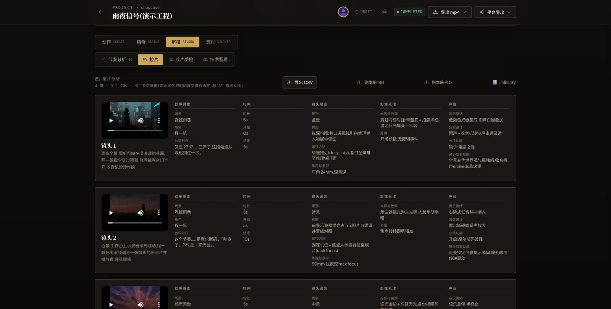 |

**实现逻辑**:这是**最能说明业务价值**的一屏 —— 每一镜给出叙事要素 / 时间 / 镜头语言 / 影像处理 / 声音五栏,
且是**流水线生成时的真实摄影语言,不是 AI 事后看图反推**。可导出 CSV / 剧本册 MD / 剧本册 PDF,
也能把外部片子的 CSV 回灌进来做复刻。
**工作流架构**:生成每镜时把景别 / 构图 / 运镜 / 焦距景深 / 光影色调 / 剪辑点 / 音乐情绪一并记进 `data`,
拉片只是把这份真值渲染出来 —— 所以它和成片永远对得上。

| 节奏分析 · 情感曲线 |
|---|
| 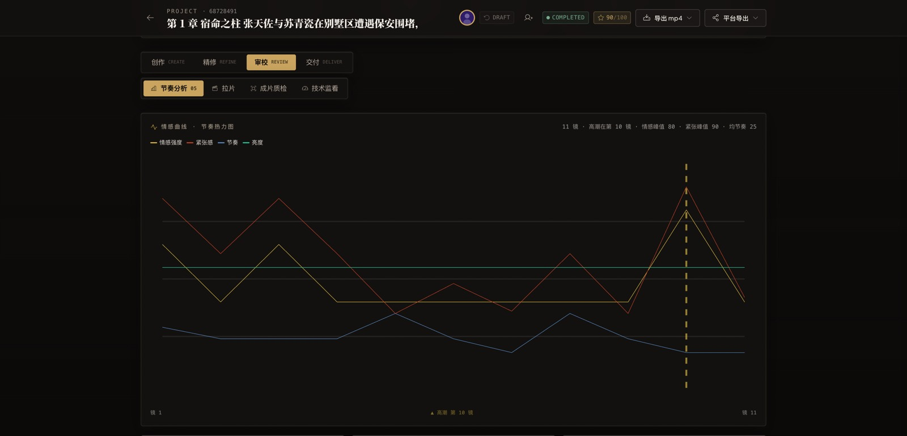 |

**实现逻辑**:四条曲线(情感强度 / 紧张感 / 节奏 / 亮度)逐镜采样,自动标出高潮镜位与峰值,
给出均节奏 —— 用来回答「这一集的钩子够不够、节奏塌没塌」。
**工作流架构**:`剧本 beat 注记 + 分镜 data → 逐镜打分 → 曲线拟合 → 高潮定位 → 反哺剪辑力度`。
